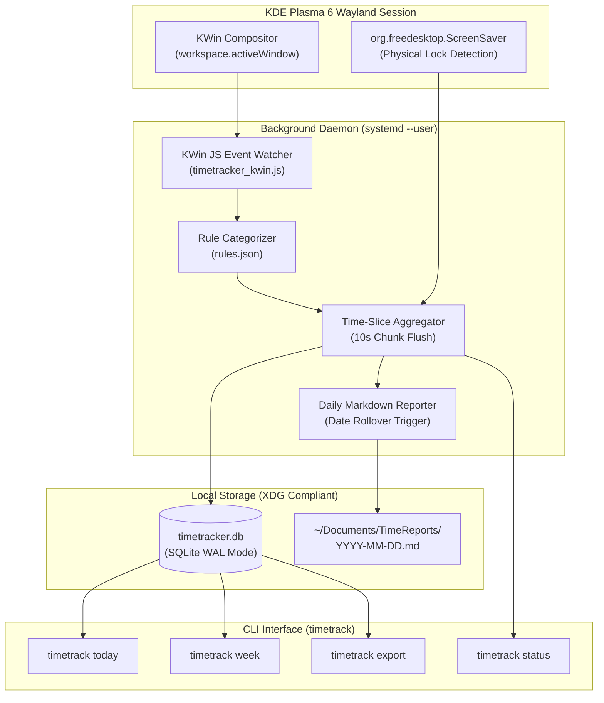

# Desktop TimeTracker (`timetrack`)

[](LICENSE)
[]()
[]()
[]()

> A lightweight, zero-dependency, privacy-first automatic desktop time tracker specifically designed for **KDE Plasma 6 on Wayland**.
>
> 专为 **KDE Plasma 6 (Wayland)** 打造的轻量级、零第三方依赖、100% 本地隐私的自动化桌面屏幕与时间追踪系统。

---

## 🌟 Why Desktop TimeTracker? (为什么选择它？)

Under the modern **Wayland** display server protocol, traditional X11-based window monitoring utilities (e.g. `xdotool`, `xprop`, `xprintidle`, `arbtt`) fail completely due to Wayland's security isolation. Heavy alternative solutions often require bloated electron apps, web servers, or non-native watchers that consume substantial system resources.

**Desktop TimeTracker** solves this natively:
1. **Native KWin Wayland Scripting**: Directly leverages KDE Plasma 6's KWin internal scripting engine and D-Bus interfaces (`org.kde.KWin`, `org.freedesktop.ScreenSaver`) to capture active window titles, application identifiers, and physical lock/sleep states seamlessly without interactive mouse interruptions.
2. **Zero External Dependencies**: Powered purely by standard Python 3 (`sqlite3`, `json`, `datetime`, `subprocess`) and KDE's built-in `qdbus6`. No pip packages to install, no compiler needed.
3. **Ultra-Low Resource Footprint**: Consumes only **~13 MB RAM** and **< 0.1% CPU** in background operation.
4. **100% Local & Privacy-First**: No telemetry, no cloud sync, no tracking. All data is kept strictly on your local machine in an indexed SQLite database (`~/.local/share/timetracker/timetracker.db`).
5. **Automatic Daily Markdown Reports**: Automatically compiles clean, structured Markdown reports with category distribution, top applications, task captions, and 24-hour activity timelines into `~/Documents/TimeReports/YYYY-MM-DD.md`.
6. **Systemd User Service**: Managed cleanly as a `systemd --user` daemon that automatically binds to your graphical session lifecycle.

---

## 🏗️ Architecture (系统架构)



---

## 🚀 Quick Start (快速安装)

### Method 1: One-Command Git Install (推荐)

```bash
git clone https://github.com/lyf266/desktop-timetracker.git
cd desktop-timetracker
./install.sh
```

The script will automatically check dependencies, deploy binaries to `~/.local/bin/desktop-timetracker`, create the `timetrack` symlink, initialize rules, and activate the systemd service.

### Method 2: Arch Linux (PKGBUILD)

```bash
git clone https://github.com/lyf266/desktop-timetracker.git
cd desktop-timetracker
makepkg -si
```

---

## 💻 Usage & Commands (日常使用)

Once installed, the background daemon tracks your activity silently. You can query your statistics at any time via the `timetrack` CLI:

```bash
# View today's screen time report with ASCII progress bars and rankings
timetrack today

# View past 7 days activity trends
timetrack week

# Check daemon health, current active application, and window title
timetrack status

# Manually export today's report (or a specific date) to ~/Documents/TimeReports/
timetrack export
timetrack export --date 2026-09-12

# Manage background service
timetrack service status
timetrack service restart
timetrack service stop
```

### Terminal Output Preview (`timetrack today`)

```text
╔═══════════════════════════════════════════════════════════════╗
║          📊 桌面时间使用简报 (2026-09-12)             ║
╚═══════════════════════════════════════════════════════════════╝
  ⚡ 专注活跃时长: 3小时25分 (82.5%)
  🔒 锁屏挂机时长: 43分钟 (17.5%)
  ⏳ 累计在线时间: 4小时08分
─────────────────────────────────────────────────────────────────

📂 【类别分布】:
  💻 编程开发   [██████████░░░░░░]  52.3% (  1h 47m)
  🌐 网页浏览   [█████░░░░░░░░░░░]  28.1% (     57m)
  📟 终端运维   [███░░░░░░░░░░░░░]  14.2% (     29m)
  💬 即时通讯   [█░░░░░░░░░░░░░░░]   5.4% (     11m)

🏆 【Top 应用排行】:
  1. Orca IDE: 1小时20分 (39.0%)
  2. Firefox: 57分钟 (27.8%)
  3. Konsole: 29分钟 (14.1%)
  4. VS Code: 27分钟 (13.1%)

🔍 【关键任务详情】:
  1. [Orca IDE] desktop-timetracker - src/desktop-timetracker (1h 15m)
  2. [Firefox] ArchWiki — KDE Plasma on Wayland (35m)
  3. [Konsole] bash — systemctl status (22m)
```

---

## ⚙️ Customization (分类规则定制)

Classification rules are defined in `~/.config/timetracker/rules.json`. You can easily add or edit categories, icons, applications, and window title keywords:

```json
{
  "categories": [
    {
      "name": "编程开发",
      "icon": "💻",
      "apps": ["orca", "code", "nvim", "rustrover", "clion", "cursor"],
      "title_keywords": [".py", ".rs", ".go", ".ts", ".c", "Visual Studio Code"]
    },
    {
      "name": "媒体娱乐",
      "icon": "🎬",
      "apps": ["bilibili", "mpv", "vlc", "spotify", "steam"],
      "title_keywords": ["YouTube", "Bilibili", "哔哩哔哩"]
    }
  ],
  "default_category": "其他应用",
  "soft_idle_threshold_seconds": 900,
  "sample_interval_seconds": 5
}
```

---

## 🔒 Privacy Pledge (隐私与安全说明)

- **Local Data Only**: All activities are stored strictly in `~/.local/share/timetracker/timetracker.db`. No network sockets are opened; no data is ever transmitted outside your machine.
- **Git Safety**: The repository comes with a comprehensive `.gitignore` ensuring that your SQLite database, logs, and generated Markdown reports can never be accidentally staged or committed to Git.
- **Clean Uninstallation**: The uninstaller preserves your personal data by default, or purges it completely when passed `--purge`:
  ```bash
  ./uninstall.sh          # Uninstalls binaries, keeps data
  ./uninstall.sh --purge  # Completely removes binaries and all historical data
  ```

---

## 📄 License

This project is licensed under the [MIT License](LICENSE).
Copyright (c) 2026 lyf266.
