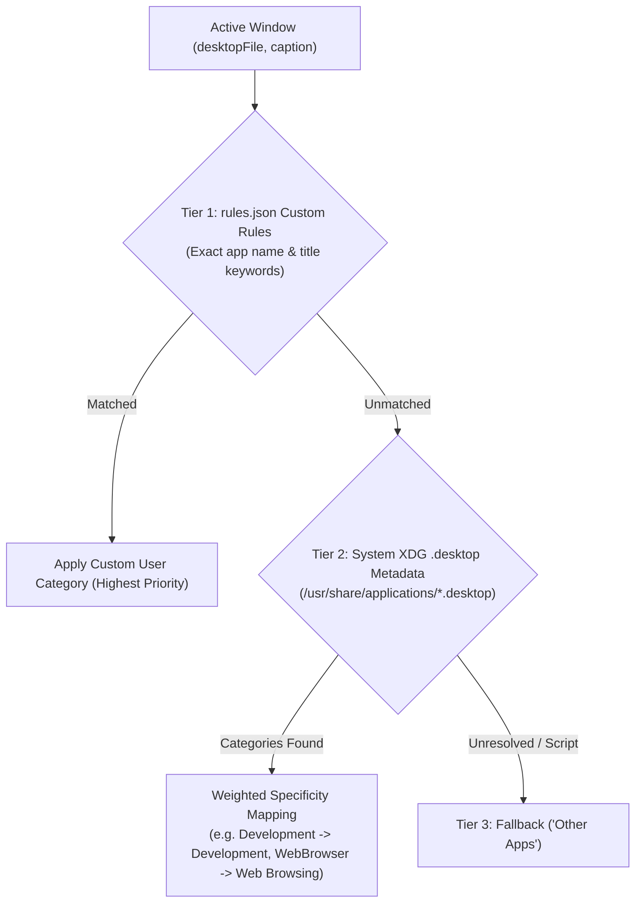
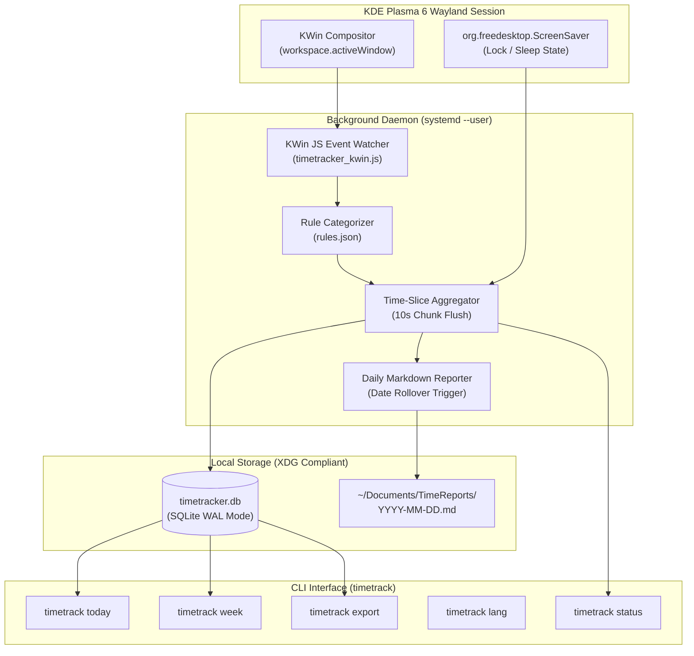

# Desktop TimeTracker (`timetrack`)

> 🌐 **Language / 语言**: English | [<u><font color="#0969da">简体中文</font></u>](README_zh.md)

[](LICENSE)
[]()
[]()
[]()

A lightweight, zero-dependency, privacy-first automatic desktop screen and time tracker specifically engineered for **KDE Plasma 6 on Wayland**.

---

## 🌟 Why Desktop TimeTracker?

Under the modern **Wayland** display server protocol, traditional X11-based window monitoring utilities (such as `xdotool`, `xprop`, `xprintidle`, and `arbtt`) fail completely due to Wayland's security isolation model. Heavy alternative solutions frequently rely on bloated Electron frameworks, local web servers, or aggressive screen-polling daemons that consume excessive CPU and memory.

**Desktop TimeTracker** solves this natively:
1. **Native KWin Wayland Scripting**: Seamlessly embeds into KDE Plasma 6's KWin internal scripting engine and D-Bus interfaces (`org.kde.KWin`, `org.freedesktop.ScreenSaver`). It passively captures active window titles, application identities, and physical lock/sleep states without any cursor interruptions or mouse clicking.
2. **Three-Tier Progressive Classification Pipeline**: Combines user custom overrides (`rules.json`), automatic system XDG `.desktop` metadata inspection with weighted specificity matching, and safe fallback. Newly installed software is categorized automatically out of the box.
3. **Zero External Dependencies**: Implemented entirely with standard Python 3 (`sqlite3`, `json`, `datetime`, `subprocess`) and KDE's built-in `qdbus6`. No pip packages, no external build steps.
4. **Ultra-Low Resource Footprint**: Consumes only **~13 MB RAM** and **< 0.1% CPU** during background operation.
5. **100% Local & Privacy-First**: No telemetry, no network calls, and no cloud synchronization. All data is persisted exclusively in a local SQLite database (`~/.local/share/timetracker/timetracker.db`).
6. **Multi-Language Support (i18n)**: Out-of-the-box support for **English** and **Simplified Chinese** across terminal outputs, category labels, and daily Markdown reports. Easily switch anytime via `timetrack lang <en|zh>`.
7. **Automatic Daily Markdown Reports**: Automatically compiles clean, structured Markdown reports with category breakdowns, application rankings, task captions, and 24-hour activity timelines into `~/Documents/TimeReports/YYYY-MM-DD.md`.
8. **Systemd User Service**: Managed cleanly as a `systemd --user` daemon that automatically starts and stops alongside your graphical session lifecycle.

---

## 🧠 Three-Tier Progressive Classification Pipeline



- **Tier 1 (User Rules)**: Highest priority. Explicit overrides configured in `rules.json` always take precedence.
- **Tier 2 (System XDG Metadata)**: Automatically parses system `.desktop` files across `/usr/share/applications/`, `~/.local/share/applications/`, and Flatpak. Resolves official application names (e.g. `OBS Studio`, `Dolphin`) and maps standard XDG categories (`TerminalEmulator > WebBrowser > IDE/Development > Chat/Email > Game/AudioVideo > Office > Graphics > System`).
- **Tier 3 (Fallback)**: Gracefully categorizes untracked scripts and background utilities as `Other Apps`.

---

## 🏗️ Architecture



---

## 🚀 Installation

### Method 1: One-Command Git Install (Recommended)

```bash
git clone https://github.com/lyf266/desktop-timetracker.git
cd desktop-timetracker
./install.sh
```

The installer verifies system dependencies, deploys the executable to `~/.local/bin/desktop-timetracker`, creates the `timetrack` symlink, initializes default rules, and enables the systemd user service.

### Method 2: Arch Linux (PKGBUILD)

```bash
git clone https://github.com/lyf266/desktop-timetracker.git
cd desktop-timetracker
makepkg -si
```

---

## 💻 Usage & Commands

Once installed, the background daemon runs silently. You can inspect your screen time at any moment with the `timetrack` CLI:

```bash
# View today's screen time report with ASCII progress bars and rankings
timetrack today

# View past 7 days activity trends
timetrack week

# Check daemon health, current active application, and window title
timetrack status

# Switch display language (English, Simplified Chinese, or auto-detect)
timetrack lang en
timetrack lang zh
timetrack lang auto

# Override language for a single command
timetrack today --lang en
timetrack today --lang zh

# Manually export today's report (or a specific date) to ~/Documents/TimeReports/
timetrack export
timetrack export --date 2026-09-12 --lang en

# Manage background service
timetrack service status
timetrack service restart
timetrack service stop
```

### Terminal Output Preview (`timetrack today --lang en`)

```text
╔═══════════════════════════════════════════════════════════════╗
║           📊 Desktop Screen Time Summary (2026-09-12)          ║
╚═══════════════════════════════════════════════════════════════╝
  ⚡ Active Focus Time: 3h 25m (82.5%)
  🔒 Locked / Away Time: 43m (17.5%)
  ⏳ Total Online Time: 4h 08m
─────────────────────────────────────────────────────────────────

📂 【Category Distribution】:
  💻 Development    [██████████░░░░░░]  52.3% (  1h 47m)
  🌐 Web Browsing   [█████░░░░░░░░░░░]  28.1% (     57m)
  📟 Terminal & Ops [███░░░░░░░░░░░░░]  14.2% (     29m)
  💬 Communication  [█░░░░░░░░░░░░░░░]   5.4% (     11m)

🏆 【Top Applications】:
  1. Orca IDE: 1h 20m (39.0%)
  2. Firefox: 57m (27.8%)
  3. Konsole: 29m (14.1%)
  4. VS Code: 27m (13.1%)

🔍 【Key Window Tasks】:
  1. [Orca IDE] desktop-timetracker - src/desktop-timetracker (1h 15m)
  2. [Firefox] ArchWiki — KDE Plasma on Wayland (35m)
  3. [Konsole] bash — systemctl status (22m)
```

---

## ⚙️ Customization

Classification rules and language preferences are stored in `~/.config/timetracker/rules.json`:

```json
{
  "language": "auto",
  "categories": [
    {
      "id": "development",
      "name": "Development",
      "icon": "💻",
      "apps": ["orca", "code", "nvim", "rustrover", "clion", "cursor"],
      "title_keywords": [".py", ".rs", ".go", ".ts", ".c", "Visual Studio Code"]
    },
    {
      "id": "media",
      "name": "Media & Gaming",
      "icon": "🎬",
      "apps": ["bilibili", "mpv", "vlc", "spotify", "steam"],
      "title_keywords": ["YouTube", "Bilibili"]
    }
  ],
  "default_category": "other",
  "soft_idle_threshold_seconds": 900,
  "sample_interval_seconds": 5
}
```

---

## 🔒 Privacy Pledge

- **Local Storage Only**: All tracked activities are stored exclusively on your machine in `~/.local/share/timetracker/timetracker.db`. No network requests are made; no analytics or telemetry exist.
- **Git Protection**: The repository features a strict `.gitignore` ensuring that your SQLite database, logs, and generated Markdown reports can never be accidentally staged or committed to Git.
- **Clean Uninstallation**: The uninstaller preserves your personal data by default, or removes it completely when passed `--purge`:
  ```bash
  ./uninstall.sh          # Removes binaries and service, preserves personal data
  ./uninstall.sh --purge  # Completely purges binaries, services, and databases
  ```

---

## 📄 License

This project is licensed under the [MIT License](LICENSE).
Copyright (c) 2026 lyf266.
