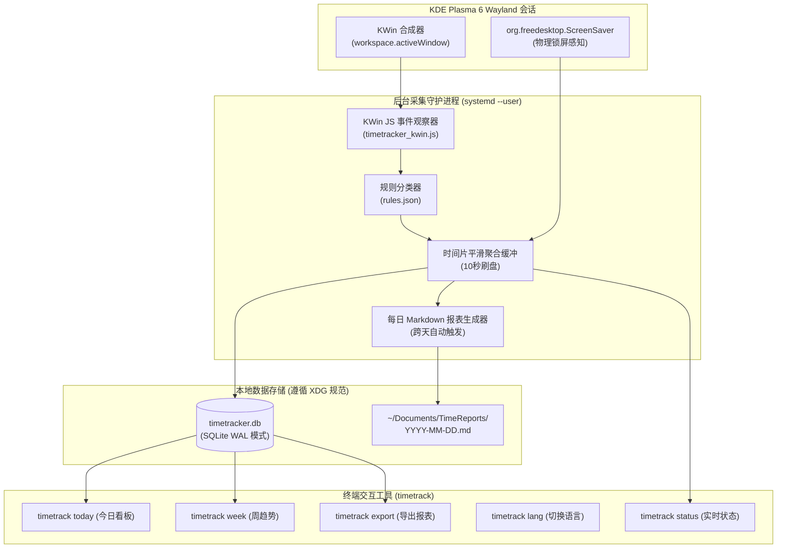

# Desktop TimeTracker (`timetrack`)

> 🌐 **语言 / Language**: [<u><font color="#0969da">English</font></u>](README.md) | 简体中文

[](LICENSE)
[]()
[]()
[]()

专为 **KDE Plasma 6 (Wayland)** 打造的轻量级、零第三方依赖、100% 本地隐私的自动化桌面屏幕与时间追踪系统。

---

## 🌟 为什么选择 Desktop TimeTracker？

在现代 **Wayland** 显示服务器协议下，由于安全隔离机制，传统的 X11 窗口监听工具（例如 `xdotool`、`xprop`、`xprintidle`、`arbtt`）会直接全面失效。而市面上的替代方案往往依赖庞大的 Electron 框架、本地 Web 服务器或非原生的截屏轮询，占用大量系统资源。

**Desktop TimeTracker** 采用原生底层方案彻底解决了这一难题：
1. **KWin 原生 Wayland 脚本驱动**：直接嵌入 KDE Plasma 6 的 KWin 内部脚本引擎与 D-Bus 接口（`org.kde.KWin`、`org.freedesktop.ScreenSaver`），零鼠标打扰、无感捕获当前活动窗口标题、应用标识与物理锁屏/休眠状态。
2. **零第三方外部依赖**：纯 Python 3 标准库（`sqlite3`、`json`、`datetime`、`subprocess`）结合系统自带的 `qdbus6`。无需额外安装任何 pip 包，无需编译。
3. **极低资源开销**：常驻内存仅约 **13 MB**，日常后台 CPU 占用率 **< 0.1%**。
4. **100% 本地与隐私优先**：无网络请求、无遥测上报、无云端同步。所有数据严格存放在本地 SQLite 索引数据库（`~/.local/share/timetracker/timetracker.db`）中。
5. **多语言国际化 (i18n)**：原生支持 **简体中文** 与 **English** 双语。控制台输出、分类显示及导出的 Markdown 日报均可随时通过 `timetrack lang <zh|en>` 自由切换。
6. **每日 Markdown 日报自动沉淀**：跨天自动或按需将分类占比、Top 应用排行、任务明细及 24 小时活跃时段编译为精美的 Markdown 报告，自动输出至 `~/Documents/TimeReports/YYYY-MM-DD.md`。
7. **Systemd 用户级服务托管**：通过 `systemd --user` 服务守护，自动随 KDE 图形会话拉起与管理。

---

## 🏗️ 系统架构图



---

## 🚀 快速安装

### 方式 1: 一键 Git 脚本安装 (推荐)

```bash
git clone https://github.com/lyf266/desktop-timetracker.git
cd desktop-timetracker
./install.sh
```

该脚本会自动检查依赖、部署执行文件到 `~/.local/bin/desktop-timetracker`、创建快捷别名软链接 `timetrack`、初始化分类配置并启动 systemd 用户服务。

### 方式 2: Arch Linux (PKGBUILD 本地构建)

```bash
git clone https://github.com/lyf266/desktop-timetracker.git
cd desktop-timetracker
makepkg -si
```

---

## 💻 日常使用与常用命令

安装完成后，后台服务将自动静默运行。你随时可以在终端敲入以下指令查看时间去向：

```bash
# 查看今日时间消费看板（带彩色条形进度图与应用/窗口排行榜）
timetrack today

# 查看过去 7 天的活跃度统计趋势
timetrack week

# 查看服务运行状态、当前前台应用与窗口标题
timetrack status

# 切换全局显示语言 (中文/英文/跟随系统)
timetrack lang zh
timetrack lang en
timetrack lang auto

# 单次命令临时指定语言输出
timetrack today --lang en
timetrack today --lang zh

# 手动导出今日报告（或指定日期）至 ~/Documents/TimeReports/
timetrack export
timetrack export --date 2026-09-12 --lang zh

# 管理后台服务状态
timetrack service status
timetrack service restart
timetrack service stop
```

### 终端输出看板样例 (`timetrack today --lang zh`)

```text
╔═══════════════════════════════════════════════════════════════╗
║                    📊 桌面时间使用简报 (2026-09-12)                    ║
╚═══════════════════════════════════════════════════════════════╝
  ⚡ 专注活跃时长: 3小时25分 (82.5%)
  🔒 锁屏挂机时长: 43分钟 (17.5%)
  ⏳ 累计在线时间: 4小时08分
─────────────────────────────────────────────────────────────────

📂 【类别分布】:
  💻 编程开发   [██████████░░░░░░]  52.3% (  1h 47m)
  🌐 网页浏览   [█████░░░░░░░░░░░]  28.1% (     57m)
  📟 终端运维   [███░░░░░░░░░░░░░]  14.2% (     29m)
  💬 即时通讯   [█░░░░░░░░░░░░░░░]   5.4% (     11m)

🏆 【Top 应用排行】:
  1. Orca IDE: 1小时20分 (39.0%)
  2. Firefox: 57分钟 (27.8%)
  3. Konsole: 29分钟 (14.1%)
  4. VS Code: 27分钟 (13.1%)

🔍 【关键任务详情】:
  1. [Orca IDE] desktop-timetracker - src/desktop-timetracker (1h 15m)
  2. [Firefox] ArchWiki — KDE Plasma on Wayland (35m)
  3. [Konsole] bash — systemctl status (22m)
```

---

## ⚙️ 分类规则与语言定制

分类规则存储在 `~/.config/timetracker/rules.json`。你可以自由增加、调整分类名、图标、对应应用标识、窗口标题关键词以及全局语言偏好：

```json
{
  "language": "auto",
  "categories": [
    {
      "id": "development",
      "name": "编程开发",
      "icon": "💻",
      "apps": ["orca", "code", "nvim", "rustrover", "clion", "cursor"],
      "title_keywords": [".py", ".rs", ".go", ".ts", ".c", "Visual Studio Code"]
    },
    {
      "id": "media",
      "name": "媒体娱乐",
      "icon": "🎬",
      "apps": ["bilibili", "mpv", "vlc", "spotify", "steam"],
      "title_keywords": ["YouTube", "Bilibili", "哔哩哔哩"]
    }
  ],
  "default_category": "other",
  "soft_idle_threshold_seconds": 900,
  "sample_interval_seconds": 5
}
```

---

## 🔒 隐私与安全承诺

- **数据仅留存在本地**：所有窗口活动仅写入本地 `~/.local/share/timetracker/timetracker.db`。不开启任何监听网络端口，绝不向外部上传任何数据。
- **Git 物理阻断**：仓库内置全面的 `.gitignore`，杜绝任何 SQLite 数据库、日志以及生成的个人 Markdown 报告被意外提交至代码仓库。
- **纯净卸载**：
  ```bash
  ./uninstall.sh          # 卸载程序与服务，保留个人历史数据
  ./uninstall.sh --purge  # 完全清除程序、服务及所有历史数据数据库
  ```

---

## 📄 开源许可证

本项目基于 [MIT License](LICENSE) 开源。
Copyright (c) 2026 lyf266.
